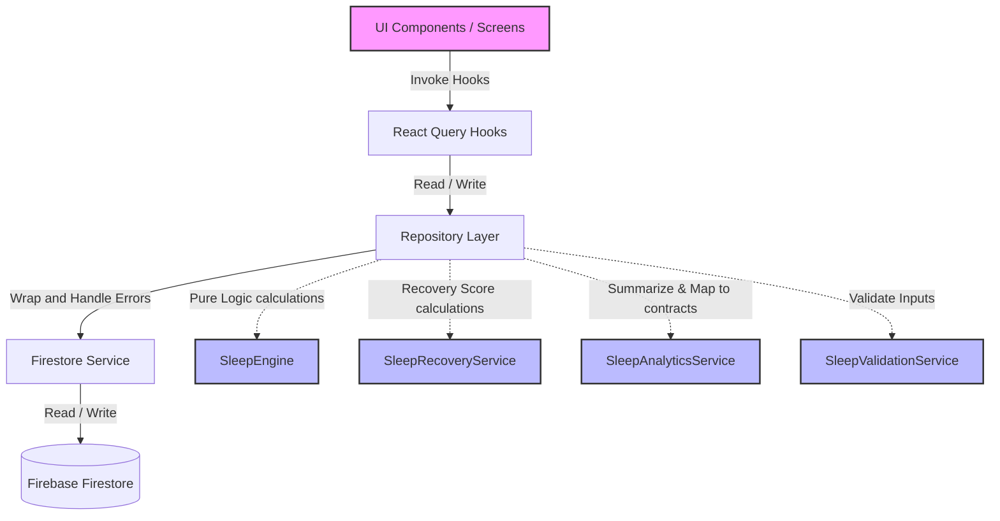

# SelfOS — Sleep Module Architecture (v1.3.0)

This document describes the architectural layout, data flow, deterministic algorithms, and extensibility points for the Sleep Module in SelfOS.

---

## 1. Directory Structure

All files are structured under `src/features/sleep` to adhere to feature-first modular guidelines:

```
src/features/sleep/
├── types/
│   ├── index.ts                # Barrel export for types
│   └── sleep.types.ts          # Domain models (SleepEntry, SleepSchedule, etc.)
├── validation/
│   └── sleep.validation.ts     # Zod validation schemas
├── firestore/
│   └── converters.ts           # Firestore marshaling converters
├── repository/
│   ├── contracts.ts            # Repository abstraction interfaces
│   └── sleep.repository.ts     # Repository implementations returning Result
├── services/
│   ├── sleep.service.ts        # Firestore DB Service calls
│   ├── sleepRecovery.service.ts # Sleep Recovery score calculations
│   ├── sleepAnalytics.service.ts # Weekly/Monthly summary builders
│   └── sleepValidation.service.ts # Error-handling validation wrapper
├── engine/
│   └── sleepEngine.ts          # Pure TS deterministic math algorithms
├── hooks/
│   ├── index.ts                # Barrel export for hooks
│   ├── queryKeys.ts            # React Query keys namespace factory
│   ├── useSleepEntries.ts      # Query/mutations hook for sleep entries
│   ├── useSleepToday.ts        # Query hook for today's sleep entry
│   ├── useSleepSchedule.ts     # Query/mutations hook for schedules
│   ├── useSleepAnalytics.ts    # Summary and FeatureAnalytics aggregator
│   ├── useSleepGoals.ts        # CRUD hook for sleep goals
│   └── useSleepRecovery.ts     # Calculations hook for body recovery
└── index.ts                    # Module barrel export entry point
```

---

## 2. Unidirectional Data Flow

The architecture follows a strict layer boundary model:



1. **Presentation Layer**: Screen components call React Query hooks.
2. **React Query Hooks**: Manages server state cache (`staleTime: 5m`, `gcTime: 15m`). Invokes repository operations. Implements optimistic updates on sleep logging.
3. **Repository Layer**: Coordinates database service operations. Delegates core mathematical business logic to pure services. Normalizes errors to `AppError` and returns `Result<T, AppError>`.
4. **Service Layer**: Handles low-level database operations (`SleepService`) or complex validation and calculations (`SleepRecoveryService`, `SleepAnalyticsService`, `SleepValidationService`).
5. **Pure Domain Engine**: Contains pure, framework-independent, deterministic TS algorithms (`SleepEngine`).

---

## 3. Pure SleepEngine Responsibilities

The `SleepEngine` is a collection of stateless calculations:

- `calculateSleepDuration`: Evaluates sleep time in minutes.
- `calculateTimeDifferenceMinutes`: Calculates circular time differences, correctly handling sleep events crossing midnight (e.g. Bedtime 11:30 PM, Wake-up 7:00 AM).
- `calculateSleepEfficiency`: Calculates wearable-ready sleep efficiency metrics.
- `calculateScheduleConsistency`: Computes circular bedtime and wake-up deviations relative to target weekday/weekend schedules.
- `calculateSleepDebt`: Accumulates sleep deficits/surpluses.
- `calculateSleepStreaks`: Computes consecutive days meeting target sleep hours.
- `calculateRollingAverages`: Calculates rolling 7-day and 30-day metrics.
- `calculateGoalCompletionPercentage`: Determines completion rates against duration, bedtime, wake-up, consistency, and recovery goals.

---

## 4. Analytics Pipeline & FeatureAnalytics

Feature analytics are exposed through a shared `FeatureAnalytics` contract. This enables the future global Insights Engine to correlate sleep habits with other domains:

- **average_duration**: Weekly average duration compared to targets.
- **average_quality**: Perceived quality score (1-10) scaled to a 0.0 - 1.0 score.
- **consistency_score**: Combined bedtime and wake-up deviation rating (0-100).
- **sleep_debt**: Rolling 7-day accumulated sleep debt (in minutes).
- **recovery_score**: Aggregated weekly physical recovery scores (0-100).
- **goal_completion**: Ratio of sleep goals accomplished.

---

## 5. Wearable Integration Points

The `SleepEntry` and `SleepQuality` types are pre-configured to receive raw wearable telemetry from Apple HealthKit, Google Health Connect, or Fitbit:

- `sleepSource`: Identifies logs as `'wearable'`, `'manual'`, or `'imported'`.
- `sleepEfficiency` & `sleepLatency`: Track physiological metrics.
- `awakeMinutes`, `deepSleepMinutes`, `remSleepMinutes`, `lightSleepMinutes`: Track sleep cycles.
- `interruptionsCount` & `tags`: Support tracking disruptions.

These fields are fully integrated into Firestore converters, ensuring no database migrations or structural schema changes are necessary when linking wearable SDKs.

---

## 6. Extension Points

### Adding a New Sleep Goal Category
1. Add the category literal to `SleepGoalCategory` in `types/sleep.types.ts`.
2. Update the Zod refinement schema in `validation/sleep.validation.ts`.
3. Add the evaluation logic inside `calculateGoalCompletionPercentage` in `engine/sleepEngine.ts`.
*No database schema changes or repository updates are needed.*

### Adding Wearable HRV/Heart Rate telemetry
1. Expand the `SleepQuality` interface in `types/sleep.types.ts` with optional parameters (e.g., `restingHeartRate`, `heartRateVariability`).
2. Add these properties to `sleepEntryConverter` under `firestore/converters.ts`.
3. Adjust the Zod schema in `validation/sleep.validation.ts` to whitelist these fields.
