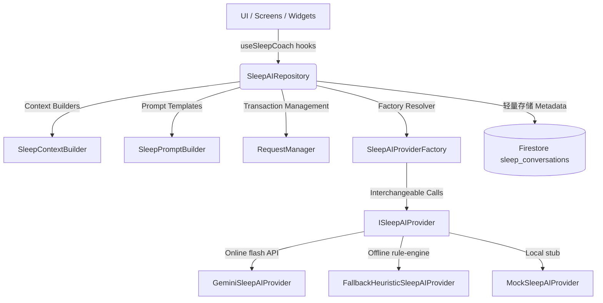

# Sleep AI Coach Architecture & Recommendations (v1.3.0)

This module provides the AI coaching, schedule optimization, and recommendation logic for the Sleep Module, designed to be fully compatible with the future Unified SelfOS AI Coach.

---

## 1. AI Architecture Overview

The Sleep AI layer follows a provider-independent repository pattern that separates prompt templates, context collection, and API executions from user interfaces.

---

## 2. Provider Lifecycle & Interchangeability

All provider engines implement the unified `ISleepAIProvider` contract:
- `askCoach()`: Handles chat prompts and Q&A.
- `generateRecommendations()`: Yields structured optimization cards.
- `generateWeeklyReview()`: Evaluates weekly sleep habits.

### Resolving & Caching
The `SleepAIProviderFactory` is the single entry point for resolving provider classes. It maintains a singleton memory cache of the instantiated engines (`gemini`, `heuristic`, `mock`).

### Graceful Fallbacks
If the `GeminiSleepAIProvider` encounters an HTTP error (e.g. 500), rate limiting (429), or fails to parse JSON schemas, it logs the failure and immediately delegates the query to the `FallbackHeuristicSleepAIProvider`. The user receives a continuous response without UI crashes.

---

## 3. Prompt Modularity

Prompt structures in `SleepPromptBuilder.ts` are split into separate static methods for maximum composition:
- `buildSystemPrompt()`: High-level coaching persona rules.
- `buildSafetySection()`: Safety rules preventing diagnostics and enforcing clinical advisory disclaimers.
- `buildContextSection()`: JSON serialization of active stats.
- `buildChatPrompt()`, `buildRecommendationsPrompt()`, `buildWeeklyReviewPrompt()`: Compose sections into final queries.

---

## 4. Context Pipeline & Privacy Filtering

The `SleepContextBuilder` extracts raw database fields and maps them to a lightweight, flat context payload.

### Privacy Strategy
- **Identifier Stripping**: Raw Firestore keys (`id`, `userId`, `createdAt`) are entirely omitted from context payloads.
- **Notes Scrubbing**: Free-text sleep journal entries are parsed using regex to scrub:
  - Email addresses (replaced with `[EMAIL]`)
  - Phone numbers (replaced with `[PHONE]`)
- **Token Constraints**: Combined text logs are truncated to 150 characters to reduce prompt payloads.

---

## 5. Request Manager (Transaction Controls)

The `sleepAIRequestManager` provides robust transaction wrapping:
- **Single Concurrency**: Aborts previous active requests under the same key to avoid double-charging token requests.
- **Exponential Backoff**: Automatically retries failed network requests up to 2 times (retrying at 500ms and 1000ms delay).
- **Request Cooldowns**: Enforces rate limiting (e.g. max 1 request per 1.5 seconds for chat).
- **Timeouts**: Enforces a strict 15-second request cancellation timeout.

---

## 6. Future Unified AI Integration Points

This module is designed to integrate into the Unified SelfOS AI Coach:
1. **Shared Contracts**: Every custom class extends base types from `src/shared/types/ai.types.ts`.
2. **Context serialisation**: `SleepPromptBuilder.buildContextSection` returns a standardized Markdown metadata sub-block, which can be directly appended into the main Unified system prompt.
3. **Common Repository routing**: The factory can easily bind into a master orchestrator factory when unified coaching is enabled.
